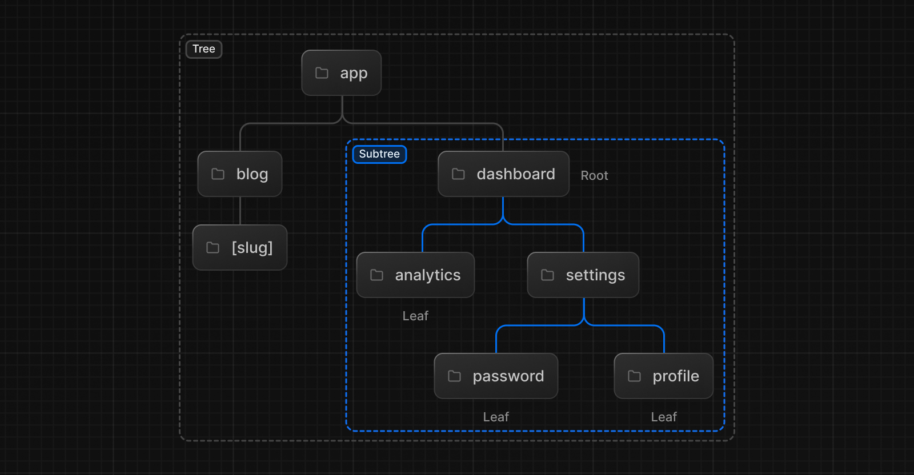
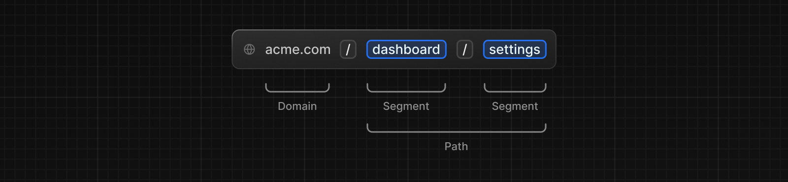

# Miro Clone

## Initial Package for Components

After the pre-installed Packages, for components used a component libary called [`shadcn/ui`](https://ui.shadcn.com/docs/installation/next)Not exactly **components libary** that it provides **re-usable components**, as its not a dependency installed. Need to pick and install components as per need.

### Preference for the Component

* Default font style.
* Slate (as base color).
* Used CSS variables (Yes)

### Component based libary - [`Shadcn Docs`]('https://ui.shadcn.com/docs')

Installed `shadcn/ui` component libary using `npm install shadcn/ui` and it's easy to use by using CLI instead of manual installation.

Used CLI for button installation initially.

### Fundamental concepts of Routing(File-system based routing) - [`Documentation Reference`]('https://nextjs.org/docs/app/building-your-application/routing')

Folders are used to define routes. A **route** is a single path of nested folders, following the file-system hierarchy from the root folder down to a final leaf folder that includes a page.js file.
**Files** are used to create UI that is shown for a route segment.

* Next JS Page Routing works in such way that it identifies the page using  **page.tsx**, **page.js**, **page.jsx** in **app** and **pages** folders respectively.

* Currently, **app** folder is used.

* Now the ***nested routing*** is done in app using **adding folder in app**.

* The folder name will be the name of route

* Then, page file is used as source of routed page.

***Tree:*** A convention for visualizing a hierarchical structure. For example, a component tree with parent and children components, a folder structure, etc.

***Subtree:*** Part of a tree, starting at a new root (first) and ending at the leaves (last).

***Root:*** The first node in a tree or subtree, such as a root layout.

***Leaf:*** Nodes in a subtree that have no children, such as the last segment in a URL path.

***URL Segment:*** Part of the URL path delimited by slashes.

***URL Path:*** Part of the URL that comes after the domain (composed of segments).

This diagram visualizes the component tree and routing terminology discussed above. The URL path "/users/john" is composed of two segments ("users" and "john"). The root layout component is "App", which renders the "Users" component as a child. "Users" then renders the user profile component "John" as its child leaf component. Together they form a subtree rooted at "App".

